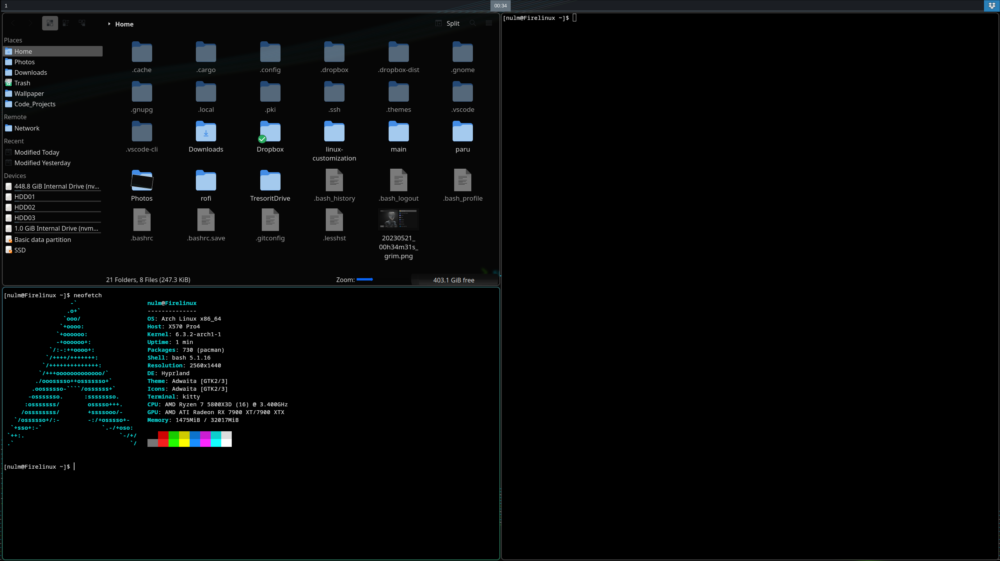

Just  a collection of scripts and customizations done to my machine.

## Main Features
- OS
    - Arch
- DE
    - Gnome - Wayland - Backup Desktop Environment
    - Hyprland - Wayland
        - Config: hyprconf
- DM
    - GDM
- Terminal
    - Kitty
    - Bash (Probably should use ZSH)
        - Config: bashconf

## Customization

- HyperLand Customizations

    - Notification
        - Mako
    - Status Bar
        - [Waybar](https://github.com/Alexays/Waybar)
            - Config: waybarconf
    - Wallpapers
        - [Wpaperd](https://github.com/danyspin97/wpaperd)
            - Config: wpaperdconf
    
    
    - Application Launcher
        - Rofi (Wayland Fork)
            - Config: roficonf
            - Theme: [Rofi Theme](https://github.com/adi1090x/rofi)
    - Display Manager
        - SDDM
            - Config: sddmconf
            - Theme: [Aerial Theme](https://github.com/3ximus/aerial-sddm-theme)
    - QT5 & QT6 Theme
        - [Inverse-dark Kvantum](https://store.kde.org/p/1365482)
        - Use Kvanturm to load them and QT5CT/QT6CT to set theme. 
    - Screenshots
        - Grim and Slurp
    

- Gnome Customizations
    - Extensions
        - Blur my Shell
        - Clipbpard Indicator
        - Gnome 4x UI Improvements
        - No overview at start-up